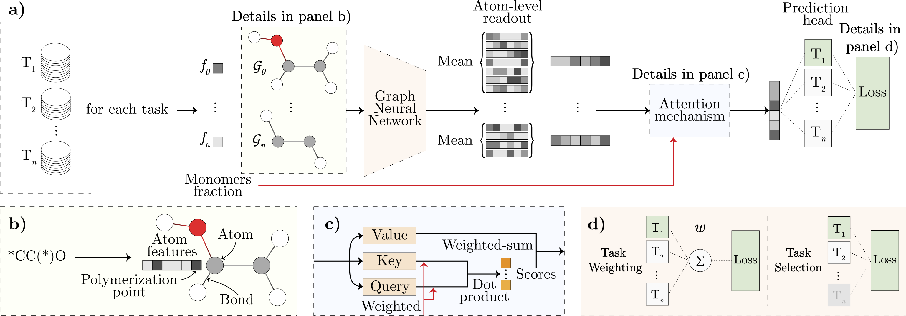

# CoPolyGNN

CoPolyGNN (CoPolymer Graph Neural Network) is a neural polymer encoder that integrates a GNN-based monomer encoder with an attention-based readout function to learn copolymer representations at multiple scales, while also handling simpler cases such as homopolymers (polymers comprised of a single monomer or repeating unit). CoPolyGNN takes advantage of a training strategy known as multi-task auxiliary learning, which helps the model prioritize the main task while leveraging auxiliary tasks for knowledge transfer. This makes its training process composed of two steps: (1) a pre-training phase that performs task selection, allowing the model to identify a subset of auxiliary tasks that best support the target task (see the pre-training folder for details), and (2) a fine-tuning phase that leverages the task selection from phase 1. Therefore, running phase 2 requires results from phase 1, such as the selected auxiliary task sets and the model for each fold.



# Datasets

This section contains the collection of datasets from polymer literature used to train CoPolyGNN. Note that in our work, all datasets were processed, and each contains the SMILES of the monomers and the corresponding polymer property. Some datasets include additional features about the monomers and polymers, such as monomer fraction or molecular weight. In these cases, an additional column was created to store this information.

| Ref | Type | Property |
|------|-------------|------------------------------------|
| [Paper \#1](https://doi.org/10.1039/D2SC02839E) | Simulated | Electron affinity |
| [Paper \#1](https://doi.org/10.1039/D2SC02839E) | Simulated | Ionization potential |
| [Paper \#2](https://doi.org/10.1038/s41524-022-00906-4) | Simulated | Radius of gyration |
| [Paper \#3](https://doi.org/10.1016/j.patter.2021.100238) | Simulated | Atomization energy |
| [Paper \#4](https://doi.org/10.1063/5.0044306) | Simulated | Bandgap (Chain) |
| [Paper \#4](https://doi.org/10.1063/5.0044306) | Simulated | Electron injection barrier |
| [Paper \#5](https://doi.org/10.1021/acsapm.0c00524) | Simulated | Rubber coefficient of thermal expansion |
| [Paper \#5](https://doi.org/10.1021/acsapm.0c00524) | Simulated | Glass coefficient of thermal expansion |
| [Paper \#5](https://doi.org/10.1021/acsapm.0c00524) | Simulated | Density at 300K |
| [Paper \#6](https://doi.org/10.1038/s41597-024-03212-4) | Simulated | Glass transition temperature |
| [Paper \#3](https://doi.org/10.1016/j.patter.2021.100238) | Simulated | Crystallization tendency |
| [Paper \#3](https://doi.org/10.1016/j.patter.2021.100238) | Simulated | Bandgap (Chain) |
| [Paper \#3](https://doi.org/10.1016/j.patter.2021.100238) | Simulated | Bandgap (Bulk) |
| [Paper \#7](https://doi.org/10.1021/acs.jpclett.2c00995) | Simulated | Ring-opening polymerization |
| [Paper \#3](https://doi.org/10.1016/j.patter.2021.100238) | Simulated | Ionization energy |
| [Paper \#3](https://doi.org/10.1016/j.patter.2021.100238) | Simulated | Refractive index |
| [Paper \#2](https://doi.org/10.1038/s41524-022-00906-4) | Simulated | Thermal conductivity |
| [Paper \#4](https://doi.org/10.1063/5.0044306) | Simulated | Bandgap (Crystal) |
| [Paper \#3](https://doi.org/10.1016/j.patter.2021.100238) | Simulated | Dielectric constant |
| [Paper \#2](https://doi.org/10.1038/s41524-022-00906-4) | Simulated | Self-diffusion coefficient |
| [Paper \#2](https://doi.org/10.1038/s41524-022-00906-4) | Simulated | Thermal diffusivity |
| [Paper \#2](https://doi.org/10.1038/s41524-022-00906-4) | Simulated | Isentropic bulk modulus |
| [Paper \#2](https://doi.org/10.1038/s41524-022-00906-4) | Simulated | Density |
| [Paper \#8](https://doi.org/10.1021/acs.jpca.3c05870) | Simulated | Ring-opening polymerization |
| [Paper \#9](https://doi.org/10.1021/acsapm.0c00524) | Simulated | Glass transition temperature |
| [Paper \#2](https://doi.org/10.1038/s41524-022-00906-4) | Simulated | Refractive index |
| [Paper \#2](https://doi.org/10.1038/s41524-022-00906-4) | Simulated | Static dielectric constant |
| [Paper \#2](https://doi.org/10.1038/s41524-022-00906-4) | Simulated | Volume expansion coefficient |
| [Paper \#2](https://doi.org/10.1038/s41524-022-00906-4) | Simulated | Linear expansion coefficient |
| [Paper \#2](https://doi.org/10.1038/s41524-022-00906-4) | Simulated | Bulk modulus |
| [Paper \#2](https://doi.org/10.1038/s41524-022-00906-4) | Simulated | Isentropic compressibility |
| [Paper \#2](https://doi.org/10.1038/s41524-022-00906-4) | Simulated | Compressibility |
| [Paper \#2](https://doi.org/10.1038/s41524-022-00906-4) | Simulated | Constant volume |
| [Paper \#2](https://doi.org/10.1038/s41524-022-00906-4) | Simulated | Constant pressure |
| [Paper \#3](https://doi.org/10.1016/j.patter.2021.100238) | Simulated | Electron affinity |
| [Paper \#10](https://doi.org/10.1038/s41524-023-01034-3) | Experimental | Glass transition temperature |
| [Paper \#10](https://doi.org/10.1038/s41524-023-01034-3) | Experimental | Inherent viscosity |
| [Paper \#11](https://doi.org/10.1021/jacs.1c08181) | Experimental | 19F NMR Signal-to-noise ratio |
| [Paper \#5](https://doi.org/10.1021/acsapm.0c00524) and [Paper \#6](https://doi.org/10.1038/s41597-024-03212-4) | Experimental | Glass transition temperature |
| [Paper \#12](https://doi.org/10.1021/acs.jcim.3c01232) | Experimental | N2 permeability |
| [Paper \#12](https://doi.org/10.1021/acs.jcim.3c01232) | Experimental | CO2 permeability |
| [Paper \#12](https://doi.org/10.1021/acs.jcim.3c01232) | Experimental | CH4 permeability |
| [Paper \#7](https://doi.org/10.1021/acs.jpclett.2c00995) and [Paper \#8](https://doi.org/10.1021/acs.jpca.3c05870) | Experimental | Ring-opening polymerization |
| [Paper \#5](https://doi.org/10.1021/acsapm.0c00524) | Experimental | Density at 300K |

# Cite

A more detailed description of CoPolyGNN is available in the paper referenced below. If you use CoPolyGNN in your research or projects, please cite our work as:

```
@inproceedings{Pinheiro_2025_CoPolyGNN,
  author = {Pinheiro, Gabriel A. and Da Silva, Juarez L. F. and Quiles, Marcos G. and Fern, Xiaoli Z.},
  editor = {Dutra, In{\^e}s and Pechenizkiy, Mykola and Cortez, Paulo and Pashami, Sepideh and Jorge, Al{\'i}pio M. and Soares, Carlos and Abreu, Pedro H. and Gama, Jo{\~a}o},
  title = {Mitigating Data Scarcity in Polymer Property Prediction via Multi-task Auxiliary Learning},
  booktitle = {Machine Learning and Knowledge Discovery in Databases. Applied Data Science Track},
  year = {2026},
  publisher = {Springer Nature Switzerland},
  address = {Cham},
  pages = {426--442},
  doi = {10.1007/978-3-032-06118-8_25},
  url = {https://doi.org/10.1007/978-3-032-06118-8_25}
}
